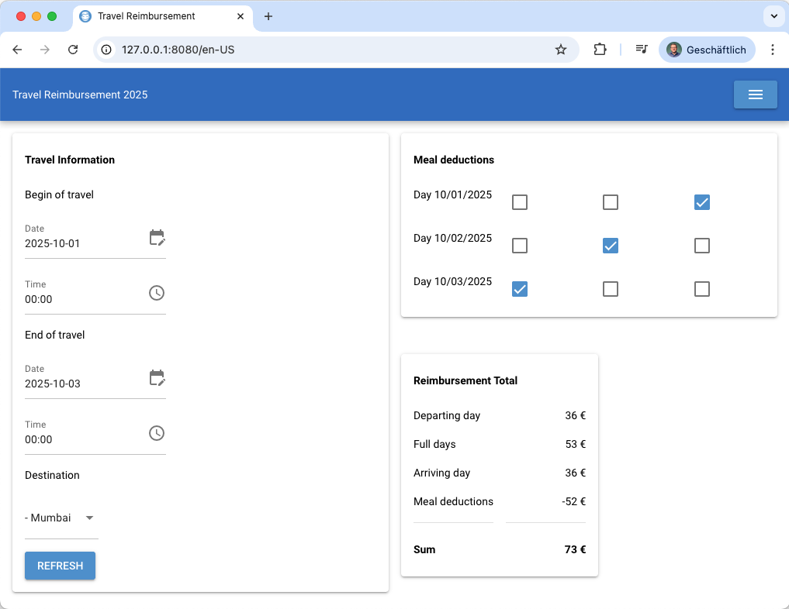

# Verpflegunsmehraufwand

Verpflegunsmehraufwand is an application to create Reisekosten
for travel expenses.

> [!WARNING]  
> The calculations are known to have broken edge cases and are incomplete.
> There is also a lot of ambiguity, misunderstanding and misinterpretation about the
> exact calculations. Don't blindly trust the numbers.



## Installation

```sh
python3 -m env env
. ./venv/bin/activate
```

## Usage

```sh
python main.py
```

